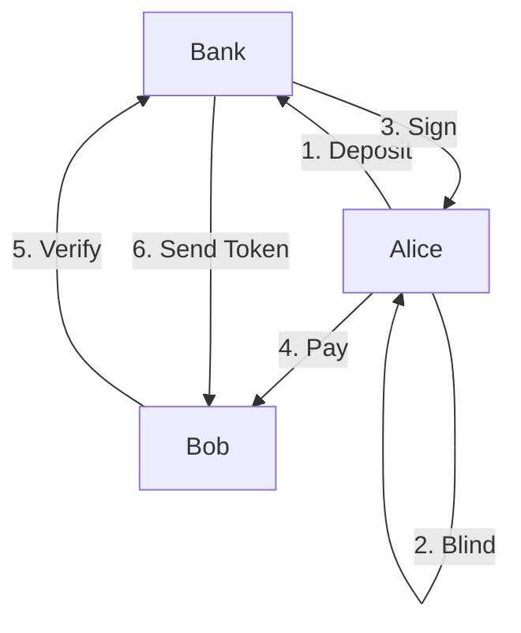

## NewChainBlind

NewChainBlind 是基于NewChain的一种匿名交易的实现。
该项目旨在隐藏交易的发送者，主要通过盲签名技术来实现。

### 应用场景

Alice想要给Bob转账1NEW，但是不想让其他人知道自己给Bob转账了，
此时Alice可以通过如下步骤来实现隐藏自己的地址：



1. Alice向Bank存款100NEW
    * 通过NewPay或NewCommander向指定地址转账
2. Alice进行盲签名
    * Alice构建面额为1NEW的消息体m，同时为该消息体增加随机字符串
    ```
    m1 = (header info, denomination, serial number), …, mk = (header info, denomination, serial number).
    ```
    * Alice通过Bank的1NEW面额的PublicKey对消息m进行加盲，得到加盲后的消息blinded和解盲因子unblinder
3. Bank进行签名
    * Alice把面额和加盲后的消息blinded发送给Bank
    * Bank检测Alice是否在自己这里存有足够面额的NEW
        * 如不存在则返回错误；
        * 如存在则减去相应面额的NEW；  
    * Bank使用自己1NEW面额对应的PrivateKey对blinded进行加密，得到sig
    * Bank把sig告诉Alice
4. Alice解盲
    * Alice通过解盲因子unblinder和sig解盲得到unblindSig
5. Alice转账1NEW给Bob
    * Alice把unblindSig和1NEW对应的消息体m告诉Bob
6. Bob向Bank验证
    * Bob告诉银行从Alice那里拿到的消息体m和unblindSig，同时告诉银行给自己转账相应面额的NEW
    * 银行通过相应面额的NEW的PublicKey来验证消息体m和unblindSig
7. 验证成功后Bank给Bob转账1NEW


### 相关说明

* 该方案的隐藏交易发送的匿名性强度会受Bank的存取款人数、交易面额种类的数量等因素的影响
  1. 交易人数
      * Bank存款人数越多，则匿名性越强
  2. 面额种类
      * Bank的面额种类越少，则匿名性越强
    
### 参考资料
1. [Blind signature(Wikipedia)](https://en.wikipedia.org/wiki/Blind_signature)
2. [Blind signatures(Birmingham)](https://www.cs.bham.ac.uk/~mdr/teaching/modules06/netsec/lectures/blind_sigs.html)
3. [e-cash(StackExchange)](https://bitcoin.stackexchange.com/questions/9544/how-does-chaum-style-e-cash-work-all-the-wiki-links-are-broken)
4. [Digital Cash(Birmingham)](http://www.cs.bham.ac.uk/~mdr/teaching/modules06/netsec/lectures/DigitalCash.html)
5. [Blind signatures for untraceable payments](http://www.hit.bme.hu/~buttyan/courses/BMEVIHIM219/2009/Chaum.BlindSigForPayment.1982.PDF)

## QuickStart

### Download from releases

Binary archives are published at https://release.cloud.diynova.com/newton/NewChainBlind/.

### Building the source

To get from gitlab via `go get`, this will get source and install dependens(cobra, viper, logrus).

#### Windows

install command

```bash
go get gitlab.newtonproject.org/yangchenzhong/NewChainBlind
```

run NewCommander

```bash
%GOPATH%/bin/NewChainBlind.exe
```

#### Linux or Mac

install:

```bash
git config --global url."git@gitlab.newtonproject.org:".insteadOf "https://gitlab.newtonproject.org/"
go get gitlab.newtonproject.org/yangchenzhong/NewChainBlind
```
run NewCommander

```bash
$GOPATH/bin/NewChainBlind
```

### Usage

#### Help

Use command `NewChainBlind help` to display the usage.

```bash
Usage:
  NewChainBlind [flags]
  NewChainBlind [command]

Available Commands:
  account     Manage NewChain accounts
  balance     Get balance of address
  blind       Blind 1NEW for address
  deposit     Use the TxHash to deposit NEW(decimal not counted)
  faucet      Get free money for address
  help        Help about any command
  info        Show the info of the bank
  init        Initialize config file and bank
  sign        Sign blinded file for address of cash 1NEW
  unblind     Unblind 1NEW for address
  verify      Verify unblinder sign file and send 1NEW to address
  version     Get version of NewCommander CLI

Flags:
  -c, --config path            The path to config file (default "./config.toml")
  -h, --help                   help for NewChainBlind
  -i, --rpcURL url             NewChain json rpc or ipc url (default "https://rpc1.newchain.newtonproject.org")
  -w, --walletPath directory   Wallet storage directory (default "./wallet/")

Use "NewChainBlind [command] --help" for more information about a command.
```

#### Use config.toml

You can use a configuration file to simplify the command line parameters.

One available configuration file `config.toml` is as follows:


```conf
rpcurl = "https://rpc1.newchain.newtonproject.org"
usedhash = ["0xe5ed16d511bb6f511c04fdc19be38b47d3494844e94db04f36fe2c7d4348b75b"]
usedunblinderhash = ["0xb18f64a9cc9ce8082675b65c174041d5fe2fb7b4b2d50084961c280ebe896d29"]
walletpath = "./wallet/"

[balances]
  0x2a8996ebb0314717dfdcd879685a9246649d7bc1 = 1
  0x511eef866c847c78b3ff67b581064007166575b1 = 22
  0x97549e368acafdcae786bb93d98379f1d1561a29 = 53

[bank]
  address = "0x873054eAcB22516E1dBC966C9aE338eef40FE15c"
  cash = "1"
  rsapemprivatekeyfile = "./key.pem"
  rsapempublickeyfile = "./pubkey.pem"
```

* RPCUrl: the NewChain RPC URL
* WalletPath: the path of the keystore file
* Bank.Address: the address of the bank
* Bank.Cash: Bank-supported denomination type (unit: NEW), only 1NEW support
* Bank.RSAPEMPrivateKeyFile: path to the RSA PEM private key file
* Bank.RSAPEMPublicKeyFile: path to the RSA PEM Public key file

The following fields exist as database storage:
* UsedHash: the list of used hash when deposit to the bank
* UsedUnlinderHash: the sha256sum of used Unlinder when verify it
* Balances: the balance of users at the bank

#### Cmd 
* account: Manage NewChain accounts, to create new account, list the accounts or update the password of the account 
* balance: Get balance of address or all the address in the `WalletPath`
* blind: (for user) Blind 1NEW for address with the public key and random message
* deposit: (for bank) Use the TxHash to deposit NEW(decimal not counted)
* faucet: Get free money for address, only work for TestNet
* help: show help about any command
* info: (for bank) Show the info of the bank
* init: (for bank) Initialize config file for bank
* sign: (for bank) Sign blinded file for address of cash 1NEW with the private key
* unblind: (for user) Unblind 1NEW with the public key, unblinder and sig from the bank
* verify: (for bank) Verify unblinder sign file and send 1NEW to address
* version: Get version of NewCommander CLI

## Example

Suppose `Alice` wants send 1NEW to `Bob` by the `Bank`,
Bank's address: 0x873054eacb22516e1dbc966c9ae338eef40fe15c
Alice's address: 0x97549E368AcaFdCAE786BB93D98379f1D1561a29
Bob's address: 0x2a8996eBb0314717dfdCd879685A9246649D7BC1

1. Bank: Create the RSA PEM file

Generate an RSA keypair with a 2048 bit private key

```bash
openssl genpkey -algorithm RSA -out key.pem -pkeyopt rsa_keygen_bits:2048
```

Extracting the public key from an RSA keypair

```bash
openssl rsa -pubout -in key.pem -out pubkey.pem
```

2. Bank: Initialize config file

```bash
# Initialize config file
NewChainBlind init
```

Just press Enter to use the default configuration, and it's best to create a new user.

```bash
Initialize config file
Enter file in which to save (./config.toml):
Enter the wallet storage directory (./wallet/):
Enter NewChain json rpc or ipc url (https://rpc1.newchain.newtonproject.org):
Enter path of Private Key RSA Pem file(./key.pem):
Enter path of Public Key RSA Pem file(./pubkey.pem):
Create a new bank account or not: [Y/n]
Your new account is locked with a password. Please give a password. Do not forget this password.
Enter passphrase (empty for no passphrase):
Enter same passphrase again:
0x873054eAcB22516E1dBC966C9aE338eef40FE15c
Your configuration has been saved in  ./config.toml
```

3. Bank: Get the info of the bank

```bash
NewChainBlind info
```

then show the public key to all users

4. Alice: Deposit

Use `NewCommander pay` to send 10 NEW to the address of bank, the send the sign tx hash to the bank

5. Bank: Check Alice deposit

Use `NewChainBlind deposit <txHash>` to add the balance for Alice

```bash
NewChainBlind deposit 0xfea3844616766cea49c21447d6e5a8c4521192b820c567bff81678615966987e
```

6. Alice: Blind

Alice blind 1NEW with a random message and the bank public key

```bash
# blind 1NEW, only support 1NEW
NewChainBlind blind pubkey.pem
```

the output of the cmd is as follow:

```txt
Data:  20190511140547.data
Blinded:  20190511140547.blinded
Unblinder:  20190511140547.unblinder
Send blinded file to bank
```

the file is named with time-based random string, 
such as `20190511140547` in this example,
Send 20190511140547.blinded to bank

7. Bank: Sign

The Bank sign the blinded file `*.blinded` for Alice.
The Bank will check the balance of Alice (the array of `balances` in `config.toml`) 
and sub 1NEW from the balance of the Alice's address

```bash
# Sign the blinded file
NewChainBlind sign 20190511140547.blinded 0x97549E368AcaFdCAE786BB93D98379f1D1561a29
```

the output is as follow:
```txt
Sub 1 NEW for 0x97549E368AcaFdCAE786BB93D98379f1D1561a29
Current balance of 0x97549E368AcaFdCAE786BB93D98379f1D1561a29 is 59 NEW
Sign:  20190511140547.blinded.sig
Send signed blinded file back to user1
```

then send the 20190511140547.blinded.sig back to the user

8. Alice: Unblind

Alice un-blinds it by using `pubkey.pem`, `*.blinded.sig` and `*.unblinder`

```bash
# Unblind with unblinder
NewChainBlind unblind pubkey.pem 20190511140547.blinded.sig 20190511140547.unblinder
```

the output is as follow:
````txt
UnblinderSig:  20190511140547.unblinder.sig
Send unblinder sig file and cash data to others
````

9: Alice Pay to Bob
1. when Alice pay 1NEW to Bob, just send him the file `20190511140547.unblinder.sig` and `20190511140547.data`
2. when Bob get the file, then him should send both of the file `20190511140547.unblinder.sig` and `20190511140547.data` to bank to verify it

9: Bank: Verify

Verify unblinder and data, then send 1NEW to Bob

```bash
# Verify unblinder and data, then send 1NEW to Bob's address
NewChainBlind verify 20190511140547.unblinder.sig 20190511140547.data 0x2a8996eBb0314717dfdCd879685A9246649D7BC1
```

if ok, then the bank pay 1 NEW to Bob's address on chain